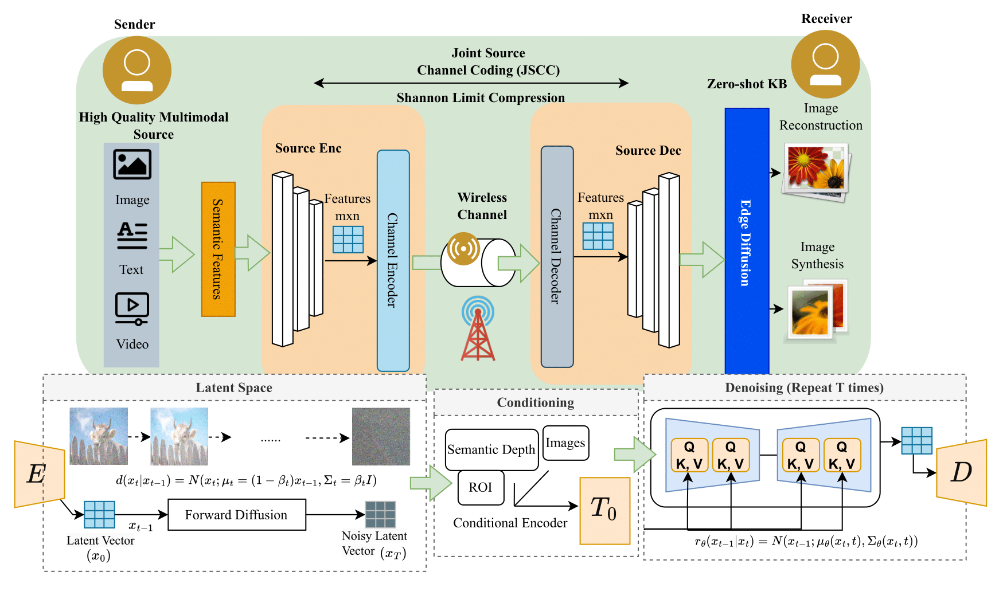

# Edge Diffusion Block: Dynamic Model with Enhanced Resolution in Semantic Communication

We propose a semantic communication framework for image transmission, harnessing the capabilities of diffusion models within the context of generative AI. This project is designed to provide an efficient and high-fidelity solution for image transmission over noisy channels. The system is composed of three core components:

## Components

### 1. Transmitter-Receiver System with JSCC

Our system employs Joint Source-Channel Coding (JSCC) for image transmission consist of an encoder and a decoder trained using coco_1000. This approach integrates the encoding of image data and the channel transmission process, optimizing the transmission performance and ensuring robustness against channel noise and compression artifacts.

### 2. Channel Layer

The channel layer simulates realistic noise and compression challenges that are commonly encountered in practical communication systems. In this project we consider two type of noises, AWGN noise and Rayleigh fading channel noise. This layer is essential for testing and validating the resilience and performance of our transmission framework under various conditions.

### 3. Image Reconstruction Block

Central to our image reconstruction process is a lightweight edge diffusion model. This model, endowed with zero-shot capabilities, is designed to restore high-fidelity images that are closely aligned with the original visual semantics. To achieve this, we utilize [diffusion super-resolution](https://huggingface.co/CompVis/ldm-super-resolution-4x-openimages) and [diffusion upscaling](https://huggingface.co/stabilityai/stable-diffusion-x4-upscaler) techniques. These methods ensure that the transmitted images retain their quality and semantic integrity even after traversing noisy channels.

## Semantic Diffusion Famework

## Key Features

- **Generative AI Integration**: Leveraging advanced diffusion models to enhance image reconstruction.
- **Robust Transmission**: Utilizing JSCC for improved performance in noisy environments.
- **Realistic Channel Simulation**: Emulating real-world noise and compression challenges to validate system robustness.
- **High-Fidelity Image Restoration**: Achieving high-quality image reconstruction with a lightweight edge diffusion model.